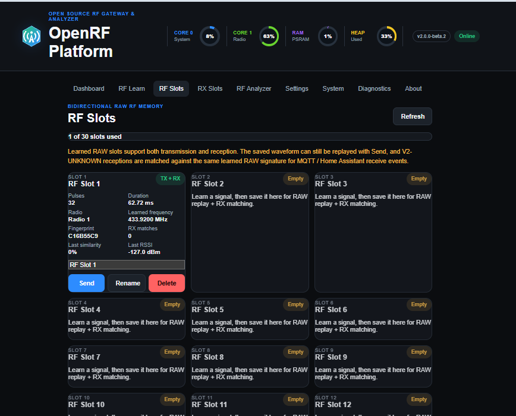
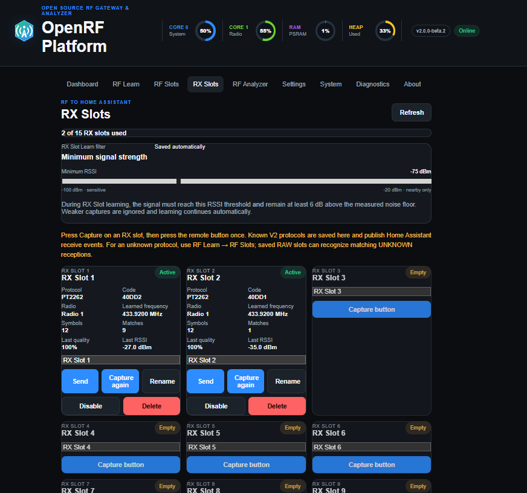
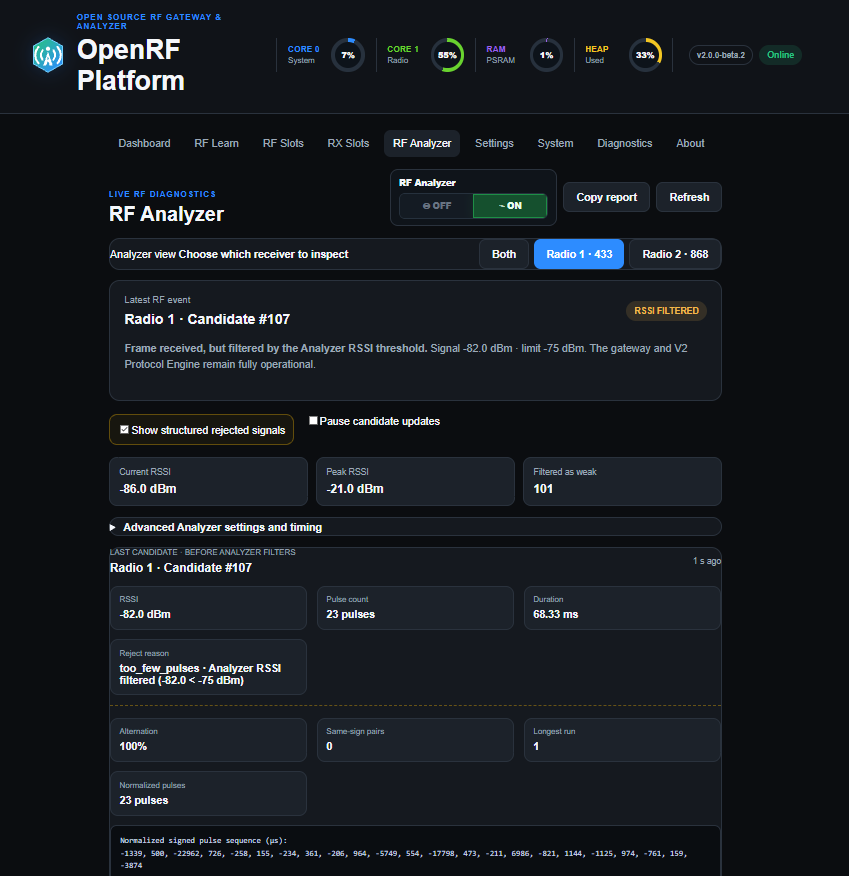
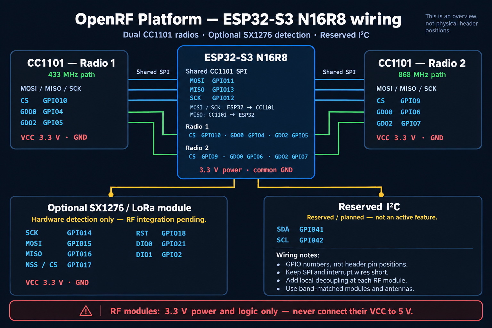

  

# OpenRF Platform

**Open-source RF gateway and signal-analysis platform for ESP32-S3, dual CC1101 radios, and local Home Assistant integration.**

**Current release: v2.0.0-beta.2**

> OpenRF Platform v2.0.0-beta.2 goes beyond the ESP32-S3 migration delivered in beta.1. It establishes the RF capture, normalization, protocol-decision, diagnostics, and learned-signal infrastructure needed for the future **Deep Analyzer**.

The Deep Analyzer aims to make unknown remotes easier to capture, compare, understand, and integrate into local automations. Fully automatic protocol recognition and integration are **not yet implemented**. This beta provides the underlying radio engine and learning workflow on which those capabilities can be built.

A major practical addition is **bidirectional RAW operation**: saved RAW signals can be transmitted from Home Assistant, while learned unknown RAW remotes can trigger Home Assistant automations.

## Release status and highlights

v2.0.0-beta.2 is the second public beta of the ESP32-S3 generation. While beta.1 established the ESP32-S3 N16R8 platform, beta.2 delivers the dual-radio V2 RF architecture, modular Protocol Engine, bidirectional RAW workflow, expanded diagnostics, and Deep Analyzer foundations. ESP32-S3 is the active development platform; the ESP8266 implementation remains available separately as a legacy release.

The main improvements are:

- **Dual-radio operation:** two CC1101 transceivers with dedicated 433 MHz and 868 MHz paths, simultaneous reception, and independent diagnostics. 
- **V2 Protocol Engine:** modular decoding with explicit `KNOWN`, `UNKNOWN`, and `AMBIGUOUS` decisions. 
- **Bidirectional RAW slots:** learn, save, replay, and recognize repeatable unknown signals. 
- **Local automation:** MQTT and Home Assistant Discovery for transmission controls and receive events. 
- **Non-exclusive RF Analyzer:** inspect traffic while normal gateway services continue running. 
- **ESP32-S3 architecture:** separate system and radio tasks, PSRAM-backed working buffers, and detailed load and memory diagnostics. 
- **Updated WebUI:** live radio status, responsive navigation, system management, OTA updates, and backup/restore. 

This remains a beta. Compatibility and recognition reliability depend on the remote, RF environment, radio configuration, and capture quality. Validate intended automations with your own hardware.

## Foundations for the Deep Analyzer

Deeper RF analysis requires consistent capture data and a clear separation between observation, classification, and action. This release provides those foundations.

| Foundation | Available in this beta |
| --- | --- |
| Processing and memory            | ESP32-S3 N16R8 with 16 MB flash, 8 MB PSRAM, and dual-core FreeRTOS task separation          |
| Radio input                      | Two CC1101 transceivers with dedicated 433 MHz and 868 MHz RF paths                           |
| Capture model                    | Unified RAW capture data retaining radio source, frequency, and RSSI                         |
| Signal processing                | Frame finalization, RAW normalization, repeated-burst recognition, and repeat reduction      |
| Protocol decisions               | V2-only modular engine with `KNOWN`, `UNKNOWN`, and `AMBIGUOUS` results                      |
| Event handling                   | Normalized protocol events, Learned RAW matching, and duplicate-event suppression            |
| Observability                    | Per-radio capture diagnostics, decoder decisions, routing information, and memory monitoring |

Together, these make captures easier to compare consistently and provide room for larger analysis workloads. Multi-capture interpretation and automatic receiver optimization remain planned extensions.

## Dual-radio RF architecture

OpenRF uses two dedicated CC1101 radio paths rather than switching one radio between bands.

| Radio | Default frequency | Role |
| --- | --- | --- |
| Radio 1                    | 433.920 MHz | Dedicated 433 MHz RF path |
| Radio 2                    | 868.350 MHz | Dedicated 868 MHz RF path |

When both radios are installed and enabled, they can receive simultaneously. Each radio has its own operating state, RF profile, counters, and diagnostics. Captures and resulting events retain their radio source.

The Dashboard displays each radio’s current state, including `Active` or `Disabled`, and operating frequency. System controls manage installed modules and radio enablement.

> **Hardware matters:** setting a frequency in software does not retune the antenna or RF matching network. Use a CC1101 module and antenna suitable for each operating band.

## V2 Protocol Engine

The receive decision path is fully V2-based. Modular decoders evaluate the full RAW capture before the engine decides whether it represents a supported protocol.

### Supported protocol families

| Protocol family | Native RX | Native protocol TX |
| --- | --- | --- |
| EV1527 / HS1527 / Princeton                | Supported | Supported |
| PT2262 / PT2272-style Tri-State            | Supported | Supported |
| HT12E                                      | Supported | Supported |
| NVKP01 Kinetic                             | Supported | RX-only   |

Support applies to compatible signal formats and timing variants, not every product sold under a protocol-family name. Native transmission uses the modular V2 TX interface; RAW replay is a separate capability.

### Classification and routing

| Decision | Result |
| --- | --- |
| `KNOWN`        | A confident, unambiguous protocol result can enter the normalized protocol-event path. |
| `UNKNOWN`      | An eligible capture can be compared with saved signals by the Learned RAW matcher.     |
| `AMBIGUOUS`    | No automatic action is taken.                                                          |

A rejected or uncertain capture is not promoted to a known protocol simply to improve recognition rates. False protocol matches are especially harmful because they prevent otherwise unknown signals from reaching the RAW matching path.

NVKP01 recognition remains conservative. Its normalized button event should not be interpreted as proof of distinct `PRESS` and `RELEASE` semantics or a globally unique transmitter identity.

## Bidirectional RAW Learn and Home Assistant control

RAW learning records pulse sequences without requiring a native protocol decoder or encoder. Saved RF Slots support both replay and matching of later eligible receptions.

### Home Assistant → OpenRF → RF transmission

1.  Capture a remote signal in **RF Learn**. 
2.  Inspect the preview and accept it into temporary memory. 
3.  Save it to a persistent **RF Slot**. 
4.  Replay the saved signal from the WebUI, MQTT, or Home Assistant. 

This allows compatible devices to be controlled even when OpenRF does not yet have a native protocol encoder for them.

Accepting a preview is **not** the same as saving a slot. The signal becomes persistent only after it is saved.

### Unknown RF remote → OpenRF → Home Assistant

1.  Learn and save a suitable RAW signal. 
2.  On a later reception, the V2 Protocol Engine evaluates the capture. 
3.  If the result is `UNKNOWN` and eligible for matching, the Learned RAW matcher compares it with saved signals. 
4.  A successful match can produce an RX event, published through MQTT and exposed through Home Assistant Discovery. 

Depending on the supported entity or discovery configuration, these receptions can be used as automation triggers or binary sensor events.

The matcher compares normalized timing and waveform structure. Repeat reduction helps compare captures containing different numbers of repeated frames, while duplicate suppression limits repeated publication of the same logical event.

RF Slots expose match counters, similarity, RSSI, and TX/RX capability so matching behavior can be inspected.

> RAW learning requires a sufficiently stable, repeatable waveform. Unknown does not mean universally learnable: rolling codes, changing payloads, security mechanisms, and inconsistent captures can prevent reliable matching or useful replay.

## RF Slots and RX Slots

The two slot types serve different purposes.

| Slot type | Stores | Intended use |
| --- | --- | --- |
| **RF Slots**                | Learned RAW pulse sequences        | RAW replay and receive matching for eligible `UNKNOWN` signals |
| **RX Slots**                | Normalized known-protocol identity | Receive events from supported V2 protocols                     |

OpenRF provides **30 persistent RAW RF Slots**. Saved waveforms are retained for transmission, while matching uses normalized comparisons.

RX Slots avoid depending on exact RAW timing equality. They identify receptions through the fields supplied by the relevant protocol module, such as protocol and code. Available identity detail varies by protocol.

RX Slot learning includes an adjustable signal-strength filter. Native TX is available only where the protocol module supports it; NVKP01 remains RX-only.

## RF Analyzer and diagnostics

On ESP32-S3, the RF Analyzer is **non-exclusive**. RX Slots, MQTT, Home Assistant, and normal gateway processing continue operating while analysis is enabled.

The Analyzer supports both radios and provides:

-  RAW candidates, accepted captures, and structured rejected captures. 
-  Clear rejection reasons, including `RSSI FILTERED`. 
-  Pulse count, duration, RSSI, and pulse-width statistics. 
-  Estimated pulse classes, base timing, and timing ratios. 
-  Polarity alternation, same-sign pairs, and run-length diagnostics. 
-  Normalized signed RAW output and copyable reports. 
-  Known-protocol recognition and unknown-signal inspection. 
-  Candidate freezing for examining a capture without live replacement. 
-  Advanced sensitivity, similarity, and occurrence controls. 

The Diagnostics page adds frame-finalization information, Protocol Engine decisions, decoder rejection details, V2 routing, Learned RAW matching, protocol TX status, and queue/core/memory information.

The latest RAW candidate and latest completed Analyzer result are separate snapshots. Check their identifiers and timestamps before assuming they describe the same reception. Analyzer presentation also does not replace the authoritative V2 routing decision.

The current RF Analyzer is distinct from the planned Deep Analyzer.

## MQTT, Home Assistant, and REST API

OpenRF publishes state and receive events under a configurable MQTT base topic. Home Assistant Discovery exposes supported transmission controls, receive entities, and device automation triggers.

Integration supports:

-  Saved RAW transmissions initiated from Home Assistant. 
-  Known-protocol RX Slot events. 
-  Learned unknown RAW remote events. 
-  Stable slot/entity identifiers. 
-  Available protocol, code, radio, quality, and RSSI metadata. 

Payload details depend on the event type and protocol. A RAW match identifies a saved waveform; it does not establish that the underlying protocol has been decoded.

The WebUI uses the same REST/JSON API available to integrations. API groups cover system health, radio state, settings, learning, RF Slots, RX Slots, analysis, OTA, and backup/restore.

## Web interface

The responsive WebUI separates daily operation from detailed diagnostics.

| Page | Purpose |
| --- | --- |
| Dashboard   | Firmware, network and MQTT status, radios, latest RF reception, and uptime            |
| RF Learn    | Capture, preview, temporarily accept, and save RAW signals                            |
| RF Slots    | Replay saved signals and inspect RAW receive matching                                 |
| RX Slots    | Learn and manage normalized known-protocol events                                     |
| RF Analyzer | Inspect captures, timing, protocol results, and RAW reports                           |
| Settings    | Configure gateway and integration settings                                            |
| System      | Memory, installed modules, radio enablement, RF tuning, updates, and backups          |
| Diagnostics | Capture, decoder, routing, matcher, TX, queue, and runtime details                    |
| About       | Platform and release information                                                      |

Live indicators expose Core 0, Core 1, PSRAM, and heap usage. Navigation supports desktop layouts and horizontal scrolling on smaller screens.

### Interface preview

<table>
  <tr>
    <td width="50%"></td>
    <td width="50%"></td>
  </tr>
  <tr>
    <td align="center"><strong>Bidirectional RAW RF Slots</strong> Saved RAW signals can be transmitted and can match later eligible UNKNOWN receptions.</td>
    <td align="center"><strong>Known-protocol RX Slots</strong> V2 protocol events can be learned and exposed to Home Assistant.</td>
  </tr>
</table>

  

<strong>Live RF Analyzer</strong> Inspect accepted and rejected captures without stopping normal gateway operation.

## ESP32-S3 architecture and memory

OpenRF uses RadioLib, PlatformIO, LittleFS, and a dual-core FreeRTOS architecture.

| Domain | Main responsibilities |
| --- | --- |
| **Core 0 — System**         | Wi-Fi, WebUI, REST API, MQTT, Home Assistant integration, OTA, configuration, and filesystem services |
| **Core 1 — Radio**          | CC1101 operation, RX/TX, learning, RAW capture, protocol processing, and RF analysis                  |

Commands pass to the radio domain through `rfCommandQueue`; events return through `rfEventQueue`. This separation reduces direct interference between normal network activity and time-sensitive radio processing.

### Memory allocation

The ESP32-S3 N16R8 target provides **16 MB flash** and **8 MB PSRAM**.

Time-critical data remains in internal RAM, including ISR capture storage, task stacks, command/event queues, and critical radio state. Networking runtime also consumes internal memory.

Larger non-ISR buffers use PSRAM where appropriate, including RAW scratch space, last-capture storage, learning buffers, and Analyzer previews. Allocation paths provide internal-memory fallback or safe failure handling.

The ISR capture limit remains **600 pulses**. Larger non-ISR working buffers support up to **2048 pulses**; this does not imply a 2048-pulse ISR capture capability.

## Supported hardware

| Hardware | Status |
| --- | --- |
| ESP32-S3 N16R8                | Current target: 16 MB flash and 8 MB PSRAM                  |
| CC1101, 433 MHz configuration | Supported dedicated Radio 1 path                            |
| CC1101, 868 MHz configuration | Supported dedicated Radio 2 path                            |
| SX1276 / LoRa                 | Hardware detection supported; RF-engine integration pending |
| ESP8266                       | Legacy platform on the `esp8266` branch                     |

SX1276 detection does not mean LoRa reception, transmission, or gateway integration is available.

Use band-appropriate modules and antennas, a suitable power supply, and the wiring expected by the selected firmware configuration.

## Hardware wiring

> **Important:** all RF modules use **3.3 V logic and power**. Do not connect a CC1101 or SX1276 module to 5 V. Connect every module to the same ground as the ESP32-S3.

### CC1101 shared SPI bus

Both CC1101 modules share the same SPI data and clock lines. Each radio has its own chip-select and interrupt pins.

| CC1101 signal | ESP32-S3 GPIO | Notes |
| --- | ---: | --- |
| `MOSI` | GPIO11 | Shared by Radio 1 and Radio 2 |
| `MISO` | GPIO13 | Shared by Radio 1 and Radio 2 |
| `SCK` | GPIO12 | Shared by Radio 1 and Radio 2 |
| `VCC` | 3.3 V | Never connect to 5 V |
| `GND` | GND | Common ground |

### Radio-specific CC1101 connections

| Signal | Radio 1 — 433 MHz | Radio 2 — 868 MHz |
| --- | ---: | ---: |
| `CS / NSS` | GPIO10 | GPIO9 |
| `GDO0` | GPIO4 | GPIO6 |
| `GDO2` | GPIO5 | GPIO7 |

### Optional SX1276 / LoRa module

The SX1276 pins below are reserved by the current hardware configuration. In beta.2 the module can be detected, but LoRa RF-engine integration is still pending.

| SX1276 signal | ESP32-S3 GPIO |
| --- | ---: |
| `SCK` | GPIO14 |
| `MOSI` | GPIO15 |
| `MISO` | GPIO16 |
| `CS / NSS` | GPIO17 |
| `RST` | GPIO18 |
| `DIO0` | GPIO21 |
| `DIO1` | GPIO2 |
| `VCC` | 3.3 V |
| `GND` | GND |

### Reserved I2C pins

| I2C signal | ESP32-S3 GPIO |
| --- | ---: |
| `SDA` | GPIO41 |
| `SCL` | GPIO42 |

Keep SPI and interrupt wires short, add local decoupling close to each RF module, and use an antenna designed for the module's operating band. If only one CC1101 is installed, leave the unused radio disabled on the **System** page.

## Installation and first start

### Requirements

-  ESP32-S3 N16R8. 
-  Suitable CC1101 modules and antennas; two modules for dual-band operation. 
-  USB data cable. 
-  PlatformIO, typically through Visual Studio Code. 

### Build and upload

1.  Open the project in Visual Studio Code with PlatformIO. 
2.  Verify the `esp32s3` environment in `platformio.ini`. 
3.  Check the hardware connections and board configuration. 
4.  Run **Build**. 
5.  Run **Upload** to install the firmware. 
6.  Run **Upload Filesystem Image** for the initial installation and whenever the WebUI files in `data/` change. 

For prebuilt installation, use matching firmware and LittleFS images from the same release:

- `OpenRF-Platform-v2.0.0-beta.2-ESP32S3-firmware.bin` 
- `OpenRF-Platform-v2.0.0-beta.2-ESP32S3-littlefs.bin` 

Follow the release’s flashing instructions and partition layout.

> **Back up before uploading LittleFS.** A filesystem image replaces LittleFS and may erase Wi-Fi, MQTT, Analyzer settings, and saved slots. Firmware and WebUI assets must remain compatible.

### First start

1.  Connect to the **OpenRF-Platform** setup access point. 
2.  Open [http://192.168.4.1](http://192.168.4.1). 
3.  Configure Wi-Fi and, if required, MQTT. 
4.  Save the configuration and allow the device to restart. 
5.  Open the assigned LAN IP address. 
6.  Check installed radios, enablement, and operating frequencies. 
7.  Test reception before creating automations. 

### Updates

OTA firmware updates are available through the WebUI. A firmware update does not substitute for a required WebUI/filesystem update; follow the release instructions for both components.

## Backup and Restore

Backup includes supported configuration, RF Slots, and RX Slots.

Create a backup before:

-  Uploading a new LittleFS image. 
-  Testing a new beta or migrating configuration. 
-  Replacing hardware. 
-  Making changes that would be difficult to recreate manually. 

Keep backups somewhere other than the device and protect them as configuration data that may contain credentials.

After restoring, verify radio settings, MQTT connectivity, slots, and Home Assistant behavior. If moving between releases, check compatibility before restoring.

## Troubleshooting

| Symptom | What to check |
| --- | --- |
| Dashboard reports an API error                 | Confirm the device’s current IP, matching firmware/WebUI versions, and browser cache. Try a hard refresh with `Ctrl+F5`.                                            |
| Settings disappeared after a filesystem upload | LittleFS was replaced. Restore a compatible backup or configure the device again.                                                                                   |
| A radio is shown as disabled                   | Check its enablement and hardware detection on the System page.                                                                                                     |
| Poor reception or short range                  | Check power, wiring, antenna, module band, frequency, RF profile, and local interference. A 433 MHz antenna is not an equivalent substitute for an 868 MHz antenna. |
| Analyzer results seem delayed or inconsistent  | Compare candidate/result timestamps, refresh cached UI assets, and inspect core load, queues, and memory diagnostics.                                               |
| A remote is not recognized                     | Inspect the full RAW capture and V2 rejection reason. An `UNKNOWN` result may be appropriate for an unsupported or incomplete signal.                               |
| RAW matching is unreliable                     | Compare multiple captures for timing and waveform consistency. Check repeat structure, truncation, changing payloads, and matcher diagnostics.                      |
| One press produces unexpected event counts     | Distinguish captures, decoder matches, and emitted logical events. Repeated transmissions may be suppressed by event deduplication.                                 |
| Home Assistant receives no event               | Check MQTT connectivity, Discovery configuration, slot state, and whether V2 routing or RAW matching produced an actionable event.                                  |

Do not relax protocol acceptance rules solely to make a difficult remote appear recognized. A false `KNOWN` decision can incorrectly claim another remote’s signal and block the intended RAW fallback.

## Current beta limitations

-  Full Deep Analyzer operation and automatic protocol integration are not available. 
-  Protocol support is limited to implemented modules and compatible variants. 
-  NVKP01 recognition remains conservative; some genuine or incomplete captures may remain `UNKNOWN`. 
-  RAW matching and replay require suitable, repeatable signals and do not provide universal rolling-code support. 
- `AMBIGUOUS` protocol results intentionally produce no automatic action. 
-  LoRa RF-engine integration is pending despite SX1276 hardware detection. 
-  ISR capture capacity remains 600 pulses. 
-  Simultaneous dual-radio reception does not imply simultaneous transmission or uninterrupted reception during every radio operation. 

## Long-term development direction

The second CC1101, unified capture layer, dual-radio engine, and initial Deep Analyzer foundations are already present. Development can now build on them.

### Multi-capture analysis

Planned work includes:

-  Capture similarity and consistency comparison. 
-  Pulse-width distributions and estimated base/bit timing. 
-  Frame length, inter-frame gaps, and repeated-frame detection. 
-  Preamble and synchronization detection. 
-  Static and changing payload regions. 
-  Static-code identification and indications of possible rolling or dynamic codes. 
-  Modulation estimation. 
-  Frequency, RSSI, and noise characterization. 

Detecting changing data would not by itself decode a rolling-code protocol or make it replayable.

### Receiver optimization

A later stage aims to compare CC1101 configurations using measured capture quality, including:

-  RX bandwidth. 
-  Data rate. 
-  Frequency deviation. 
-  Modulation. 
-  Synchronization settings and other relevant RF parameters. 

The intended result is assistance in selecting a suitable RF profile, potentially including automatic optimization once it can be validated reliably.

### Guided integration

The target workflow is **Analyze → Learn → Save → Home Assistant**, supported by capture comparison, optimization, verification, and testing.

> Press the remote. Let OpenRF capture, compare, analyze, and optimize the signal, then help turn it into a usable local automation.

Community RF profiles are a possible later extension. LoRa integration, additional radio technologies, and optional cloud functionality remain longer-term possibilities rather than current release capabilities.

These are development directions, not promises of completed automatic protocol generation or universal remote compatibility.

## Repository branches and documentation

| Branch | Purpose |
| --- | --- |
| `esp32-s3`    | Default branch and active development platform; current release **v2.0.0-beta.2** |
| `esp8266`     | Legacy implementation; final feature release **v1.2.0**                           |

The ESP8266 branch may receive critical fixes, but new feature development targets ESP32-S3.

Start with this README, then consult:

- [CHANGELOG.md](CHANGELOG.md) — project and release history.
- [RELEASE_NOTES_V2.0.0-beta.2.md](RELEASE_NOTES_V2.0.0-beta.2.md) — detailed V2 Protocol Engine, dual-radio, RAW and Deep Analyzer foundation development history.
- [RELEASE_NOTES_V2.0.0-beta.1.md](RELEASE_NOTES_V2.0.0-beta.1.md) — historical ESP32-S3 migration release.
- [RELEASE_NOTES_V1.2.0.md](RELEASE_NOTES_V1.2.0.md) — final ESP8266 feature release.
- [RELEASE_NOTES_V1.1.0.md](RELEASE_NOTES_V1.1.0.md) and [RELEASE_NOTES_V1.0.0.md](RELEASE_NOTES_V1.0.0.md) — earlier release history.
- [CONTRIBUTING.md](CONTRIBUTING.md) — contribution guidance.
- [LICENSE](LICENSE) — MIT license terms.

Use documentation from the branch and release you are running. Historical development notes may describe earlier behavior.

## Responsible use

Use OpenRF only with devices you own or are authorized to test.

Follow applicable radio regulations, permitted frequency bands, transmission power limits, and duty-cycle requirements. Do not interfere with other radio users or use the project to bypass security systems.

Keep the management interface and MQTT access appropriately protected. Validate automations before relying on RF events to control physical equipment.

## License and credits

OpenRF Platform is released under the **MIT License**. See [LICENSE](LICENSE).

Created and maintained by **Kocsis Krisztián**, with implementation assistance, architecture discussions, and documentation support from **ChatGPT (OpenAI)**.

⭐ If OpenRF Platform is useful to you, consider starring the project on GitHub.

---

<!-- OPENRF_STATS_START -->
## OpenRF Platform Statistics

- Repository views: **1214**
- Repository clones: **339**
- Tracking since: **2026-08-07**

<!-- OPENRF_STATS_END -->

---

## ☕ Support OpenRF Platform

OpenRF Platform is free and open source.

If you find the project useful and would like to support its continued development, hardware testing, and future features, you can buy me a coffee:

[☕ Buy me a coffee](https://buymeacoffee.com/krissz55555)

Thank you for supporting OpenRF Platform!
